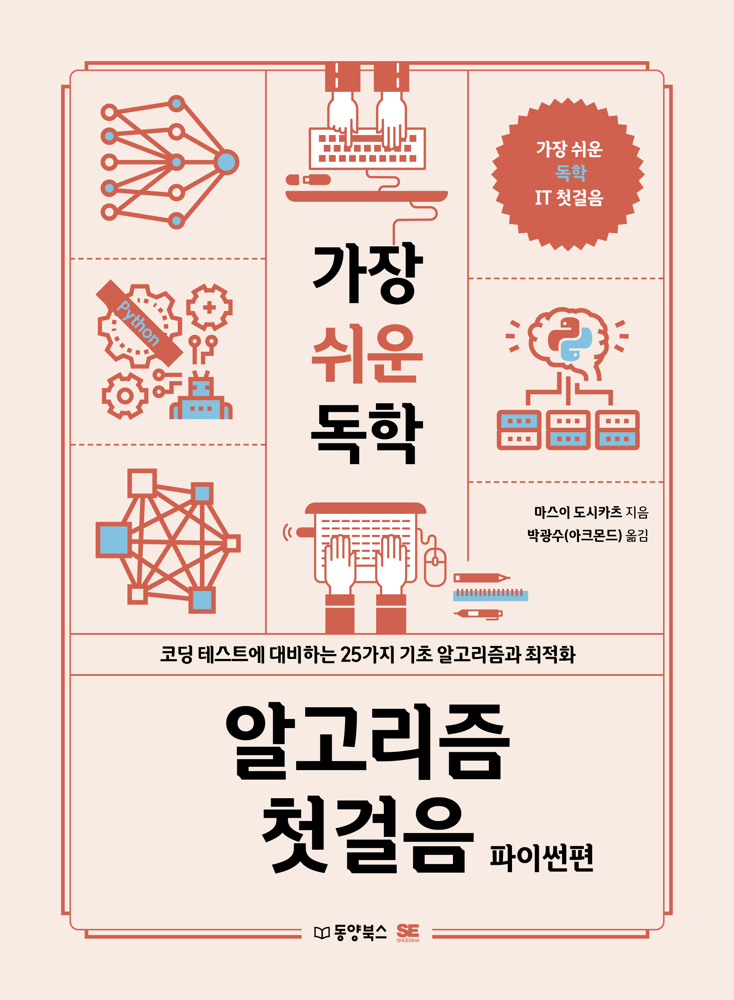

# 『가장 쉬운 독학 알고리즘 첫걸음 - C&자바편』

동양북스 『가장 쉬운 독학 알고리즘 첫걸음 - C&자바편』의 깃허브 저장소입니다.

## 예제 파일 다운로드
저장소를 클론하지 않을 분은 [이곳](https://bit.ly/38VLu9x)을 눌러서 예제 파일을 다운로드하세요.

## 구매하기
[교보문고](https://bit.ly/3wqgUxd) | [YES24](https://bit.ly/3P3kuWf) | [알라딘](https://bit.ly/3vLYwQ2) | [인터파크](https://bit.ly/3OZJEoQ)

## 책 소개

**파이썬 알고리즘의 기초와 시간 복잡도 기반의 최적화 요령까지 배운다!**

이 책은 25가지 알고리즘을 통해 파이썬 프로그래밍 입문을 막 끝낸 사람이 기초 알고리즘 학습에 어떻게 접근해야 하는지 알려줍니다. 또한 파이썬 프로그래밍을 공부한 지 오래된 사람을 위해 파이썬 프로그래밍과 자료구조의 기초를 복습할 수 있도록 도와줍니다.

코딩 테스트나 기술 면접에 대비해 알고리즘을 배운다면 코드의 처리 성능을 나타내는 시간 복잡도까지 알 필요가 있습니다. 시간 복잡도는 기술 면접의 단골 질문이며, 똑같이 문제를 해결했더라도 시간 복잡도를 고려해 코드를 작성한 사람이 좋은 개발자로 성장할 가능성이 크다고 평가하기 때문입니다. 따라서 처리 성능이 좋은 알고리즘 코드를 작성할 때 시간 복잡도의 개념을 어떻게 활용하는지 소개해 기술 면접이나 코딩 테스트를 준비하는 사람에게도 도움이 되도록 합니다.

## 예제 파일 실행 방법
윈도우에서 마이크로소프트의 Visual Studio Code로 예제 파일을 실행하려는 분은 [이곳](https://bit.ly/3MTUieO)을 참고하세요. 윈도우에서 제트브레인의 PyCharm으로 예제 파일을 실행하려는 분은 [이곳](https://bit.ly/3FgWKte)을 참고하세요.