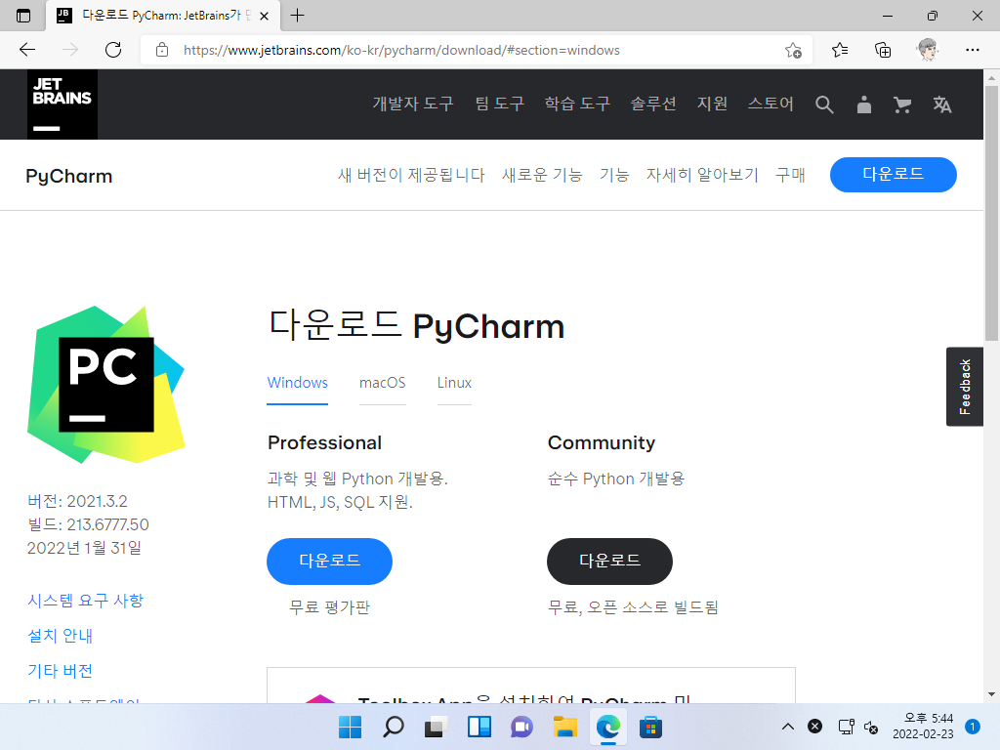
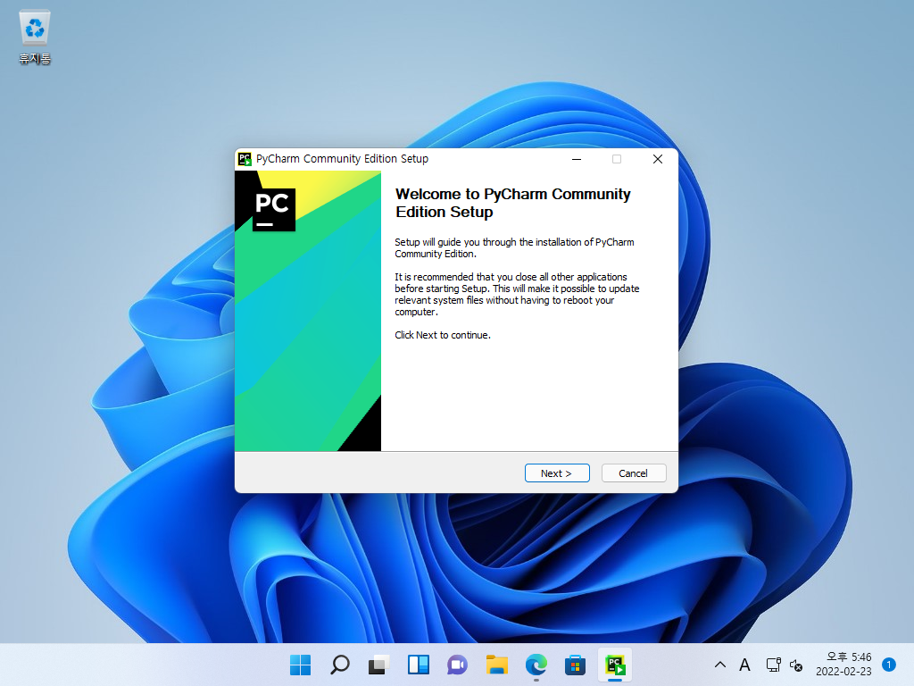
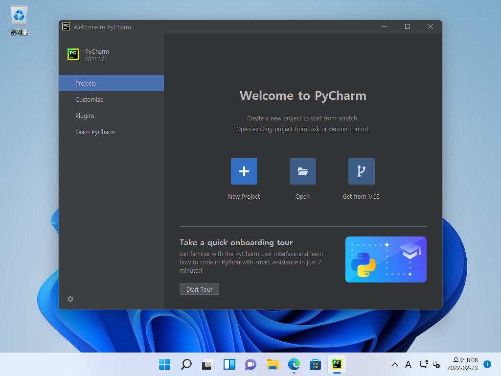
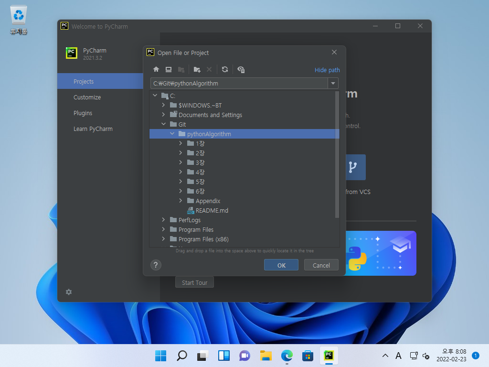
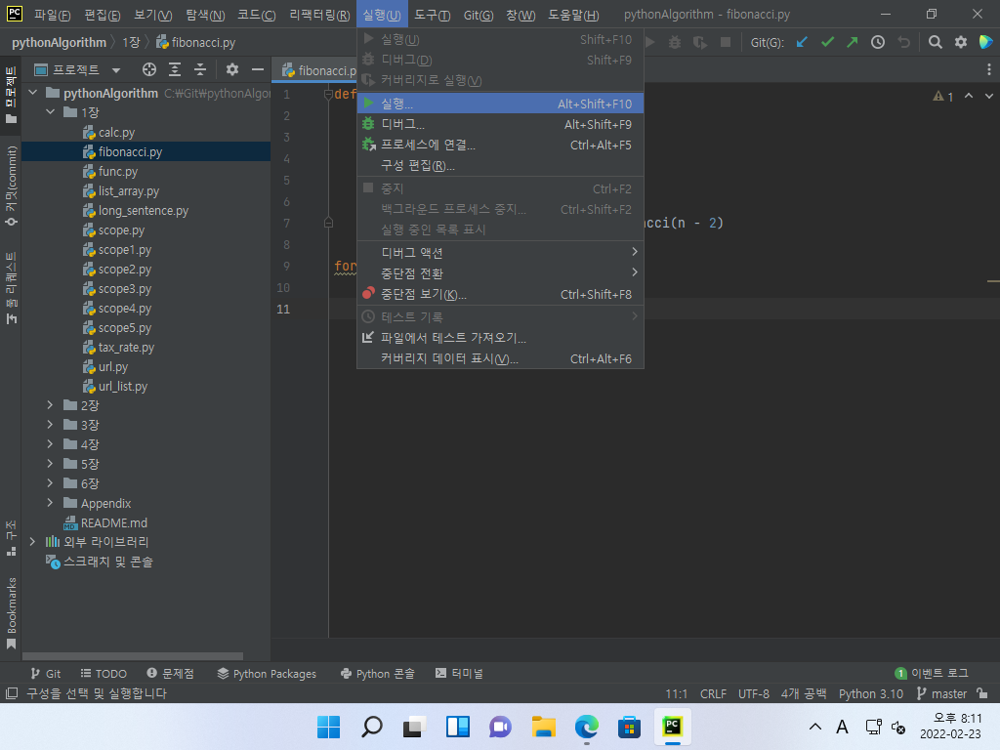
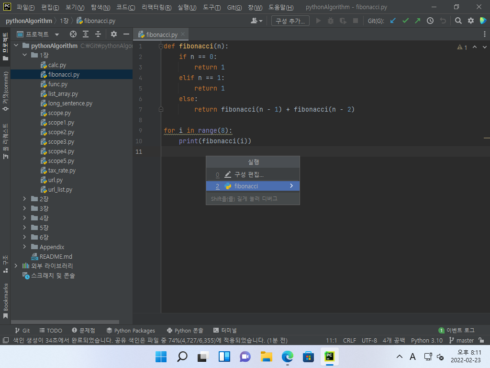
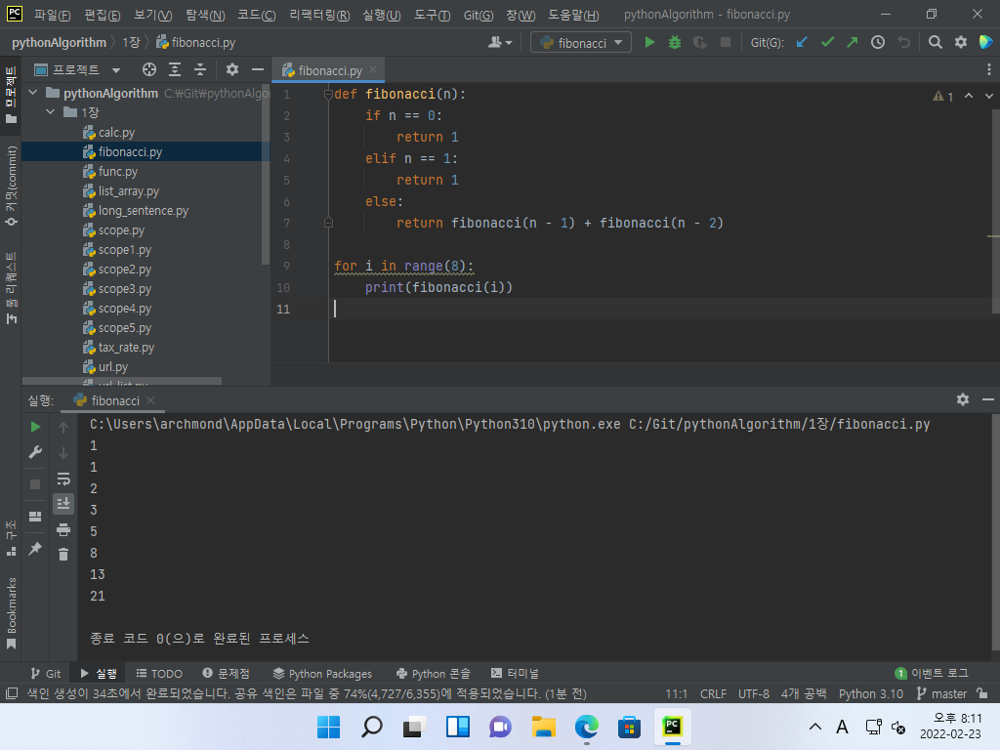

# 예제 코드 실행하기(Windows 버전)

## 1. PyCharm 설치하기

### PyCharm 다운로드 및 설치하기

▼[https://www.jetbrains.com/ko-kr/pycharm/](https://www.jetbrains.com/ko-kr/pycharm/)에 접속해 [다운로드] 단추를 누릅니다.

▼Community 버전을 [다운로드]하여 설치합니다.

▼설치 옵션은 기본값으로 진행하면 됩니다.

## 2. Python 예제 파일 실행하기

### Python 예제 파일 열고 실행하기

▼PyCharm을 실행해 [Open] 단추를 누릅니다.

▼예제 파일이 위치한 폴더를 엽니다.

▼좌측 탐색 창에서 예제 파일을 열고, [실행] 메뉴에 들어가 [실행]을 클릭합니다.

▼실행할 대상을 선택해 더블클릭합니다.

▼하단 실행창에 Python 실행 결과가 나타납니다.

