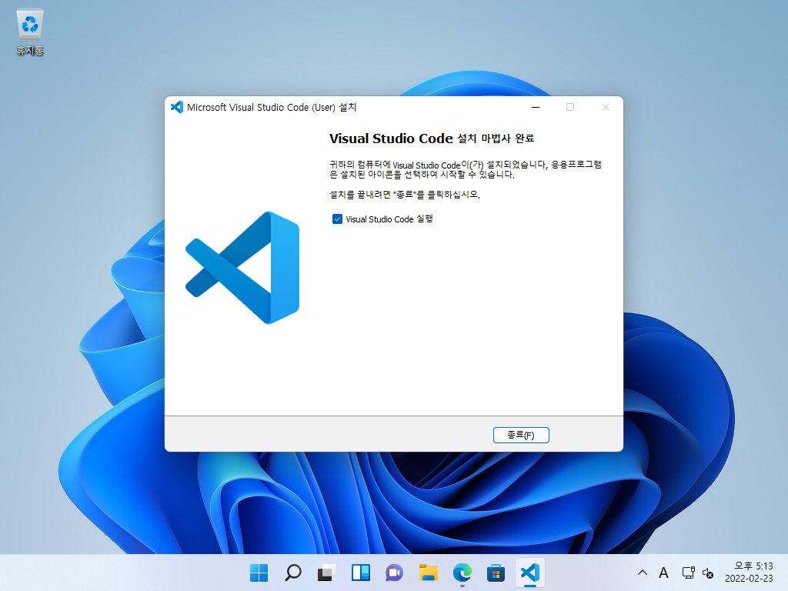
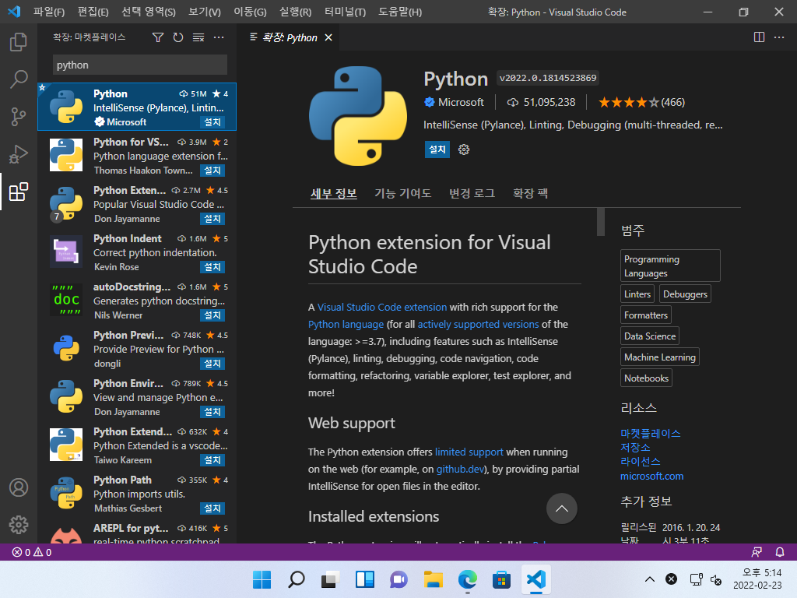
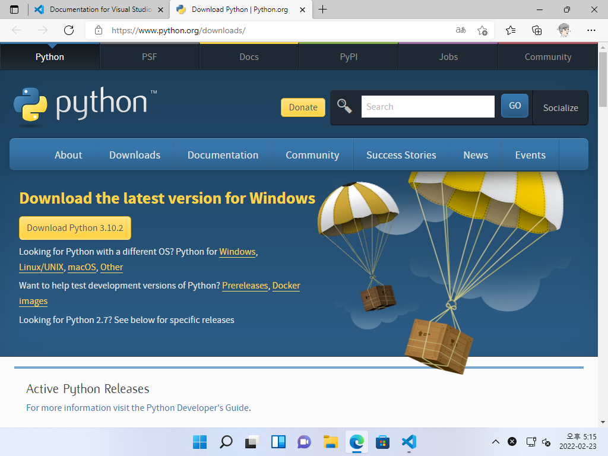
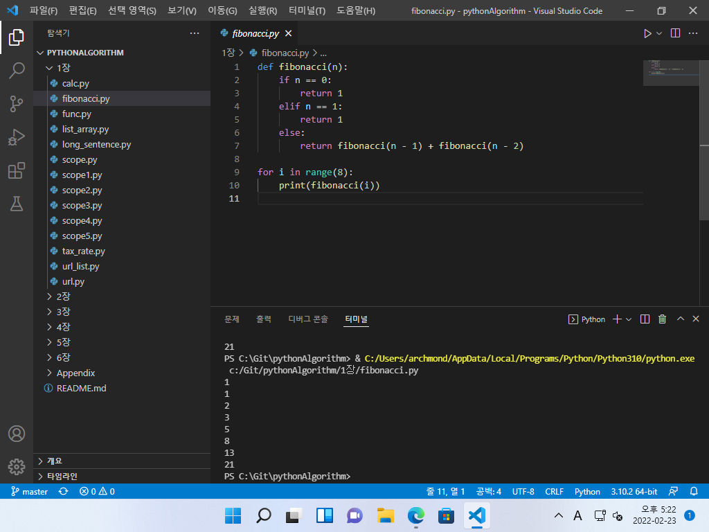

# 예제 코드 실행하기(Windows 버전)

## 1. VSCode 설치하기

### VSCode 다운로드 및 설치하기

▼[https://code.visualstudio.com/](https://code.visualstudio.com/)에 접속해 Visual Studio Code(VSCode)를 다운로드하여 설치합니다.

▼설치 옵션은 기본값으로 진행하면 됩니다.

▼VSCode를 실행하면 한국어 언어 팩을 설치할 수 있다고 알려줍니다. 우측 하단의 버튼을 눌러 '설치 및 다시 시작'합니다.

▼자동으로 언어 팩이 설치되어, 재시작된 뒤에는 한글로 화면이 표시됩니다.

## 2. Python 예제 파일 실행 환경 구축하기

### 확장 기능 설치하기

▼좌측의 확장 메뉴나, 키보드 단축키로 (Ctrl+Shift+X)를 눌러 'python' 키워드로 검색합니다. Python(Microsoft 제작)이 나오면 설치 단추를 누릅니다.

### Python 컴파일러 설치하기

▼Python 컴파일러가 설치되어 있지 않은 경우, 우측 하단에 아래와 같은 경고가 나타납니다. [Download] 단추를 누릅니다.

▼[https://www.python.org/downloads/](https://www.python.org/downloads/)에 접속됩니다. Download Python 단추를 눌러 파이썬을 다운로드하여 설치합니다.

▼설치 옵션은 기본값으로 진행하면 됩니다.

## 3. Python 예제 파일 실행하기

### Python 예제 파일 열고 실행하기

▼VSCode에서 예제 파일이 위치한 폴더를 엽니다.

▼좌측 탐색 창에서 예제 파일을 열고, 우측 상단의 ▷(실행) 단추를 눌러 실행합니다.

▼하단 터미널에 Python 실행 결과가 나타납니다.

